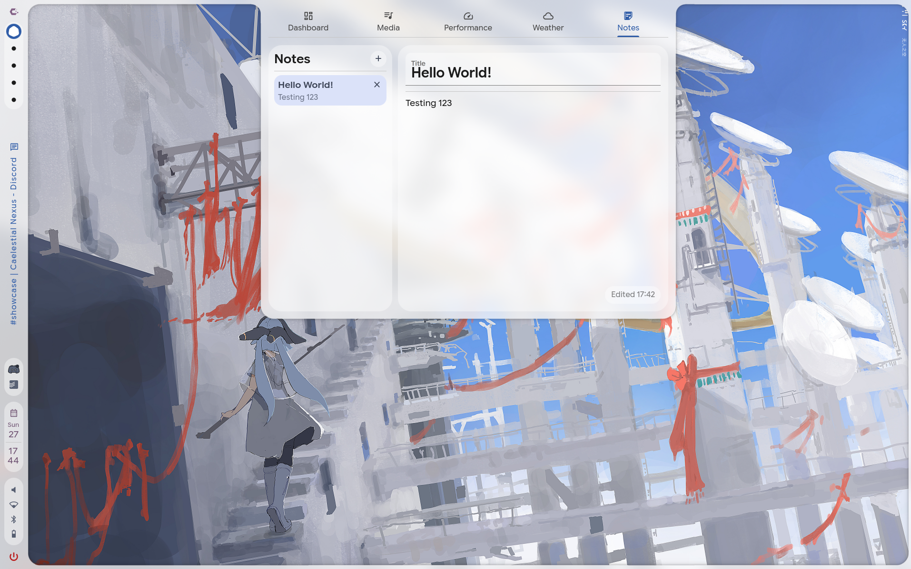
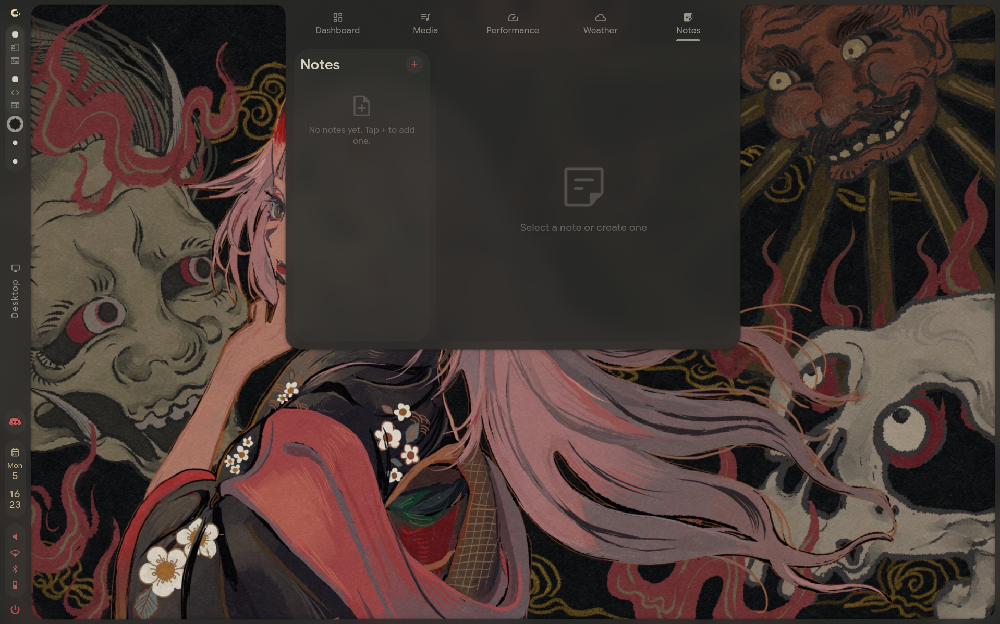

# Caelestia Notes Tab

Notes that you can save to your [Caelestia](https://github.com/caelestia-dots/shell) dashboard.

## Screenshot:




A notes panel with a list on the left and an editor on the right: add, rename, edit, and delete notes that persist across restarts and autosaves when closed.

## Install

```bash
git clone https://github.com/ItsXyzzy/Caelestia-Notes-Dashboard
cd Caelestia-Notes-Dashboard
./install.sh
```

Then restart the shell using:
```bash
caelestia shell -k
caelestia shell
```
It installs into `~/.config/quickshell/caelestia`, copying the system config there first if you don't have one.

## Uninstall

```bash
./uninstall.sh          # This keeps your notes
./uninstall.sh --purge  # This deletes them too
```

## Good to know

- Registering the tab modifies `Content.qml`. The original is saved as `.bak`, and restoring it is part of the uninstaller.
- The install hooks into the existing **Weather** dashboard tab (the Notes component is added right after it). If your `Content.qml` doesn't have the stock weather tab, the installer will refuse to run — install caelestia-shell unmodified first.
- Typing in Notes needs the dashboard to accept keyboard focus, so the installer adds one condition to `ContentWindow.qml`. The whole dashboard now grabs focus while open.
- Your notes are saved to `~/.local/state/caelestia/notes_tab.json`.
- Only tested on Cachy with Hyprland.

## Manual install

1. Copy `qml/modules/dashboard/NotesTab.qml` into `~/.config/quickshell/caelestia/modules/dashboard/`.
2. In `modules/dashboard/Content.qml`, add a `Component { id: notesComponent; NotesTab {} }` next to the weather one, and this entry to the tab list:
   `{ component: notesComponent, iconName: "sticky_note_2", text: Tr.tr("Notes"), enabled: true }`
3. In `modules/drawers/ContentWindow.qml`, add `|| screenState.dashboard` to the `keyboardFocus` condition.

## License

GPL-3.0
